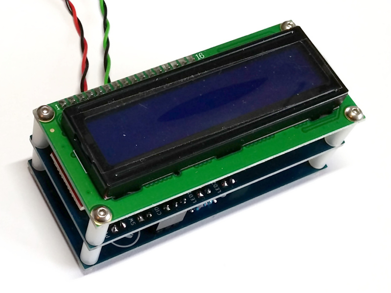

# Calling Line Identification receiver module

In the Calling Line Identification receiver module a _Holtek HT9032D_ is used to decode the call set-up message (containing information related with the incoming call, in MDMF (Multiple Data Message Format)) on an analog phone line. An Arduino Nano on the accompanying interface board processes the data looking for and (if present) displaying:

- date and time (month, day, hours, minutes)
- calling line identity (the telephone number)
- reason for absence of calling line identity (either "unavailable" or "private")
- calling party name
- reason for absence of calling party name (either "unavailable" or "private")

The dimensions of the receiver module and the Arduino interface board match a standard 1602 display, which is no coincidence.

## Supplementary information and helpful hints

Telephone people seem to be pretty ambitious at inventing or reusing abbreviations and acronyms. To make sure most people (and search engines) have a better idea what information is received, processed and displayed, here is a short list of some abbreviations:

- the service providing the caller's identification (often used synonymously with caller's phone number)
  - CID (Caller ID, Caller Identification)
  - CLI, CLID (Calling Line Identification)
  - CNID (Calling Number Identification)
- the caller's phone number
  - CID (Caller ID)
  - CNIP (Calling Number Identification Presentation)
  - CNIR (Calling Number Identification Restriction)
  - CLIP (Calling Line Identification Presentation)
  - CLIR (Calling Line Identification Restriction)
- the caller's name
  - CNAM (Caller ID Name)
  - CNAP (Calling Name Presentation)
  - CNAR (Calling Name Restriction)
  - CNIP (Calling Name Identification Presentation)
  - CNIR (Calling Name Identification Restriction)

If the HT9032 does not work (as expected) turning it off and on again might help. Force a power-down by setting pin 5 (PDWN) high.

## Things to do

- add resilience to erroneous call set-up message or transmitted parameters therein (check for valid checksum, parameter length, ASCII characters)
- maybe save more than just the parameters of the last call

## References (inspiration and further reading)

- [ETSI EN 300 659-3 V1.3.1 (2001-01)](http://www.etsi.org/deliver/etsi_en/300600_300699/30065903/01.03.01_60/en_30065903v010301p.pdf)
- [Holtek HT9032 datasheet](https://www.holtek.com/documents/10179/116711/HT9032C_Dv170.pdf)
- [Holtek - Type I caller ID using the HT9032](https://web.archive.org/web/20130616010406/http://www.holtek.com/English/tech/appnote/comm/pdf/ha0053e.pdf)
- [ePanorama.net - Telephone interfacing circuits](https://www.epanorama.net/circuits/teleinterface.html)
- [Arduino Forum - 6v6gt - Telephone Caller ID Dev Kit](https://forum.arduino.cc/index.php?topic=642458.0)
- [GitHub - aniline - PSTN Caller ID to WiFi interface](https://github.com/aniline/wifi_pstn_cid)
- [Instructables - rjkorn - Call Blocker/Telemarketer Stopper](https://www.instructables.com/Call-Blocker-Telemarkter-Stopper/)
